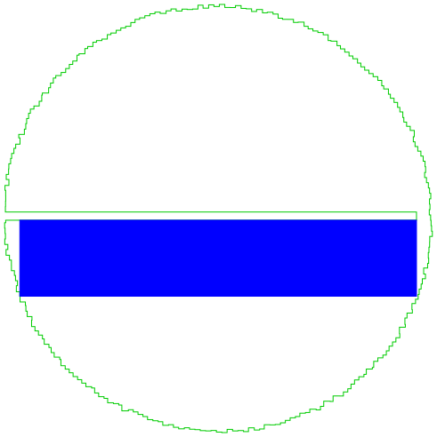

# Day 9: Movie Theater

[[^ up]](../../README.asciidoc) [[< prev]](../day-08/README.MD) [[next >]](../day-10/README.MD) [[solution in c ✨]](./solve.py)

<!-- article begin -->

## Part 1

Iterate all provided points, find the one creates the largest area.

## Part 2

Similar to part 1, but before checking the area, filter out the rectangles that can not be fully contained within the polygon formed by the provided points.

In a nutshell:

- Check the 4 points of the new rectangle, all points should be contained within the polygon.
  - Use ray-casting to find it out, since the shape is _concave_.
  - Starting from the point and keep moving right, it should had an odd count of intersections with the polygon edges.
- Check the 4 edges of the new rectangle, none of them should intersect with any edge of the polygon.
  - Ignore the ones with same gradient (i.e. both horizontal or both vertical).
  - Use cross product to find if two segments intersect. Exclude the cases when they overlap (`product = 0`).

Gemini is quite suitable to learn about this geometry problems, and was used to understand the concepts how this works.

<!-- article end -->

---

* Puzzle: https://adventofcode.com/2025/day/9
* Input: https://adventofcode.com/2025/day/9/input

